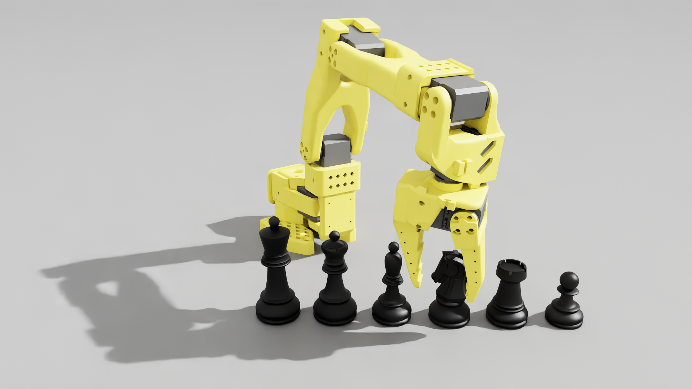
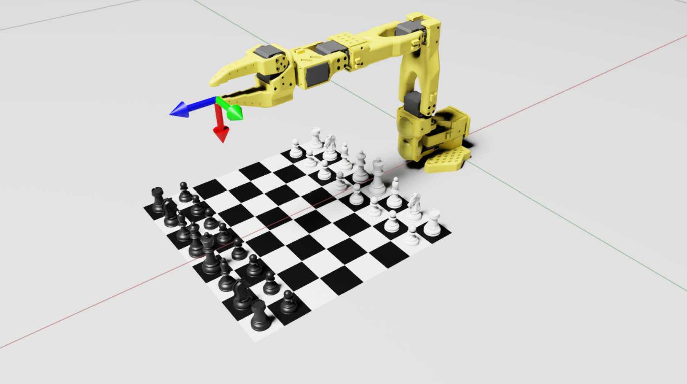

# RoboChess Challenge

> [!WARNING]
> UNDER DEVELOPMENT: This project is actively being built and may change frequently.




Robotic chess manipulation in [NVIDIA Isaac Sim](https://developer.nvidia.com/isaac/sim), built around the [LeRobot SO-101](https://github.com/TheRobotStudio/SO-ARM100) arm. The project combines a cuMotion-based motion-planning extension, an Isaac Lab task scaffold for RL, and a set of chess scenarios (from a 1D toy board up to full 8x8 chess) used to develop and test pick-and-place manipulation.

## Features

- **cuMotion Plan extension** ([exts/cumotion.plan](exts/cumotion.plan)) — an Isaac Sim Kit extension that drives the SO-101 arm with collision-free IK and motion planning (NVIDIA [cuMotion](https://github.com/nvidia-isaac/cumotion)) to pick up and place chess pieces.
- **Chess scenarios** ([so101.py](exts/cumotion.plan/CuMotion_Plan_python/cumotion/so101.py)) — selectable board setups for incrementally harder manipulation tasks:
  - `1D chess` — a single rank of 6 pieces, for basic pick-and-place testing.
  - `3x3 chess` — a 3x3 board with pawns only.
  - `4x4 chess` — the Mallett–Hill–Boyer [minichess](https://en.wikipedia.org/wiki/Minichess) variant (king, 2 knights, rook, 4 pawns per side).
  - `8x8 chess` — standard full chess setup.
- **Newton example** ([newton/example_so101.py](newton/example_so101.py)) — a standalone SO-101 example using the [Newton](https://github.com/newton-physics/newton) physics engine.
- **Isaac Lab task** ([lab/ChessRobot](lab/ChessRobot)) — an Isaac Lab extension (`Template-Chessrobot-Direct-v0`) scaffolding the SO-101 chess environment for reinforcement learning.

## Scenarios

| 3x3 chess | 4x4 chess | 8x8 chess |
|---|---|---|
|  |  |  |

## Repository layout

```
exts/cumotion.plan/   Isaac Sim Kit extension (UI + cuMotion-driven SO-101 pick-and-place)
assets/                Robot, chess piece, and board USD assets
lab/ChessRobot/        Isaac Lab extension/task for RL (Template-Chessrobot-Direct-v0)
newton/                Standalone SO-101 example using the Newton physics engine
scripts/               Helper scripts (e.g. cuMotion)
package/               Robot meshes (e.g. .dae)
```

## Installation

Full setup notes (Isaac Sim, cuMotion, Isaac Lab) live in [setup.md](setup.md). In short:

1. Install [Isaac Sim](https://developer.nvidia.com/isaac/sim) and point `ISAAC_SIM_PATH` at it.
2. Install [cuMotion](https://github.com/nvidia-isaac/cumotion) into the Isaac Sim Python environment.
3. (Optional, for RL) install [Isaac Lab](https://isaac-sim.github.io/IsaacLab/) and the `ChessRobot` task package from `lab/ChessRobot`.

See [setup.md](setup.md) for the exact commands (Linux and Windows/PowerShell).

## Usage

Start Isaac Sim with the `cumotion.plan` extension enabled:

```sh
& "$env:ISAAC_SIM_PATH\isaac-sim.bat" --ext-folder exts --enable cumotion.plan
```

From the extension UI, load one of the chess scenarios (default is `4x4 chess`, configurable in [load_example_assets](exts/cumotion.plan/CuMotion_Plan_python/cumotion/so101.py)) and use the panel to plan and execute pick/place motions with the SO-101 arm.

For the Isaac Lab RL task:

```sh
python lab/ChessRobot/scripts/zero_agent.py --task=Template-Chessrobot-Direct-v0
```

## Status

Active challenge project.
