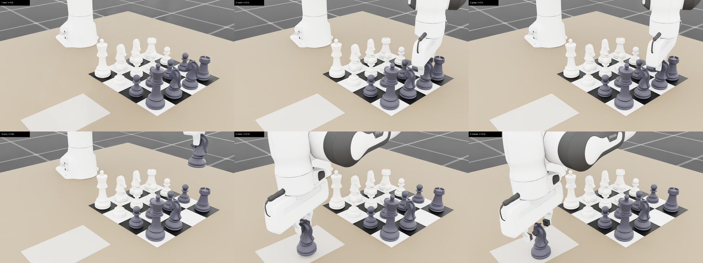
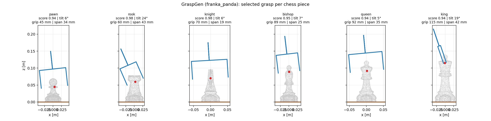
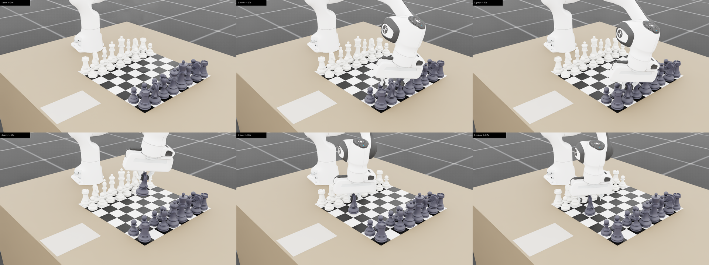

# Franka chess picking

A Franka Emika Panda picking chess pieces off a board in Isaac Lab, with the grasps
chosen by [GraspGen](https://github.com/NVlabs/GraspGen) and the resulting
trajectories recorded through Isaac Lab's `RecorderManager`.



*One recorded episode, replayed from the dataset: the arm reaches over the board,
pinches the knight's neck, carries it clear of the tallest pieces, and sets it down
in the capture tray.*

```
assets/chess/*.usdc                 render-only pieces shipped with the project
        |
        |  lab/scripts/prepare_chess_assets.py           (pxr + trimesh + CoACD)
        v
assets/chess/generated/s150/*.usd   rigid bodies, convex-decomposition collision
assets/chess/generated/s150/*.obj   the same geometry, for GraspGen
        |
        |  lab/scripts/graspgen_chess_grasps.py          (GraspGen venv, CUDA)
        v
.../grasps/chess_grasps.json        ranked 6-DOF grasps in the piece frame
        |
        |  lab/scripts/generate_chess_pick_demos.py      (Isaac Lab)
        v
lab/datasets/*.hdf5                 recorded demonstrations
        |
        |  lab/scripts/render_chess_demo.py
        v
lab/datasets/renders/*.png|mp4      replayed trajectories
```

## 1. Piece assets

The shipped `.usdc` pieces are single 200k-triangle meshes with no physics. They
also sit at the low end of what an 80 mm Franka gripper can work with, so
`prepare_chess_assets.py` scales them (default **1.5x**) and bakes:

* a rigid body root with `RigidBodyAPI` + an explicit mass from the mesh volume,
* **CoACD convex decomposition** (16 hulls per piece) as the collision geometry. A
  plain convex hull would fill in the neck of the piece, which is exactly the
  feature the gripper needs,
* a reference to the original mesh for the visuals, so nothing is duplicated.

Dimensions at 1.5x:

| piece  | height | base  | narrowest shaft | mass   |
|--------|--------|-------|-----------------|--------|
| pawn   |  70 mm | 47 mm | 11 mm @ 48 mm   |  25 g  |
| rook   |  79 mm | 53 mm | 24 mm @ 58 mm   |  60 g  |
| knight |  97 mm | 54 mm | 27 mm @ 92 mm   |  63 g  |
| bishop | 108 mm | 52 mm |  7 mm @ 94 mm   |  44 g  |
| queen  | 122 mm | 58 mm |  8 mm @ 109 mm  |  79 g  |
| king   | 141 mm | 59 mm |  9 mm @ 127 mm  | 104 g  |

## 2. Grasps from GraspGen

`graspgen_chess_grasps.py` runs the `franka_panda` GraspGen model (diffusion
generator + discriminator) on each baked mesh, 2000 samples per piece, then filters
the predictions down to grasps that are executable on a piece standing on a board:

* the approach must be within 75° of straight down,
* no part of the gripper may dip below the board surface,
* the piece must fit inside the finger span (< 75 mm of the 80 mm stroke),
* the discriminator score must clear 0.5.

GraspGen's own argmax is almost always a near-horizontal side grasp of the shaft.
Those score well in isolation but are the worst choice on a populated board, so the
ranking penalises tilt beyond 25°:

```
rank_score = score - tilt_weight * max(0, tilt_deg - preferred_tilt_deg) / 90
```

The result is a consistent strategy across all six pieces — **come down from above
and pinch the shaft just under the head**:

| piece  | score | tilt | grip height        | span  |
|--------|-------|------|--------------------|-------|
| pawn   | 0.94  |  6°  |  45 mm (64% up)    | 34 mm |
| rook   | 0.98  | 24°  |  60 mm (76% up)    | 43 mm |
| knight | 0.98  |  6°  |  70 mm (73% up)    | 19 mm |
| bishop | 0.95  |  7°  |  89 mm (82% up)    | 25 mm |
| queen  | 0.94  |  5°  |  92 mm (75% up)    | 35 mm |
| king   | 0.94  | 19°  | 115 mm (82% up)    | 42 mm |



Every piece except the knight is a solid of revolution, so each grasp is stored in a
canonical azimuth and the free rotation about the piece axis is left to the motion
generator.

### Frame conventions

GraspGen's gripper convention is **+Z approach, +X finger closing**, with the origin
at the gripper base link. The Isaac Lab Franka closes along `panda_hand`'s **Y**
(verified in sim: the fingers sit at ±0.04 in Y). The conversion is therefore

```
T_panda_hand = T_graspgen @ Rz(90°)
```

and, because the GraspGen depth (105.3 mm) matches the `panda_hand`→TCP offset
(103.4 mm), a GraspGen grasp *is* a `panda_hand` pose — which is exactly what the
differential-IK action term commands.

## 3. Environment

`RoboChess-Franka-Chess-IK-Abs-v0` (and the `-IK-Rel-` variant) put a Franka at the
table edge with the board 0.45 m in front of it.

### Board size

At their native 60 mm the squares are too tight for these pieces: a 1.5x king has a
59 mm base, so it and its neighbour sit ~1 mm apart and a 22 mm finger has nowhere to
go. The board is therefore stretched (`board_scale`, default **1.4** -> 84 mm
squares) while the pieces stay put, which opens a ~25 mm gap between neighbours. The
8x8 board keeps scale 1.0, because stretching a 0.48 m board by 1.4 pushes most of it
outside the Franka's reach.

The capture tray is parked automatically beside the board's -y edge, and destinations
are filtered to those that are both within reach and safely inside the table edge.

* **Actions** — absolute task-space `panda_hand` pose (differential IK, DLS) plus a
  binary gripper, 8 numbers.
* **Command** — `ChessMoveCommand` samples "move piece *i* to square *s*" each
  episode. Targets are the empty board squares plus a six-slot capture tray; the
  full 4x4 minichess setup has no empty square, so without the tray it would have
  nowhere legal to move a piece.
* **Terminations** — `success` when the commanded piece is upright, settled, on its
  target square **and out of the gripper**; plus time-out, pieces-off-table, and
  `board_disturbed`, which fails the episode if any *other* piece is knocked over. A
  demo that completes the move but barges a neighbour over is worse than useless for
  imitation, so it must not reach the dataset.
* **Observations** — joint state, TCP pose, gripper opening, the move command, the
  commanded piece's pose, and every piece's pose; a `subtask_terms` group exposes
  grasp/lift/place for Isaac Lab Mimic.

Two things about the Isaac Sim 6.0 Franka asset needed working around, both handled
in `chess/robot_configs.py`:

1. `isaaclab_assets.robots.franka` still points at the 5.0 `panda_instanceable.usd`,
   which 404s. The 6.0 asset is `franka_panda.usda` with identical joint/body names.
2. That asset nests each link inside its parent, so (a) `FrameTransformerCfg` needs
   full prim chains, and (b) `disable_gravity` only reaches `panda_link0` because
   `modify_rigid_body_properties` stops descending at the first rigid body. The arm
   then sagged 30–50 mm against the stock IK gains — enough to miss a piece
   entirely. Stiffer position gains (9000/4500) hold it instead, which is also
   closer to the real robot's gravity-compensated controller. Steady-state tracking
   is now **~2 mm / 0.3°**.

## 4. Trajectory generation

`generate_chess_pick_demos.py` runs a vectorised state machine over N environments:

```
pre_grasp -> descend -> close -> lift -> transfer -> place -> release -> retreat -> settle
```

Each leg interpolates the `panda_hand` pose (lerp + quaternion geodesic slerp) and
then **waits for the arm to actually arrive** before advancing. A purely
time-triggered schedule closes the fingers wherever the arm happens to be, which on
a first pass meant tens of millimetres short of the grasp and a piece squirting out
of the jaws.

Three runtime decisions matter:

* **Grasp selection.** The stored GraspGen candidates are re-scored against the live
  board: each candidate (and, for pieces of revolution, each of 16 azimuths) is
  checked by transforming the open fingers into the world and measuring how far they
  dip into neighbouring pieces, modelled as upright cylinders. The best grasp of a
  piece in isolation is often the one that rakes the gripper through its neighbours.
* **Place pose.** Rather than assuming a nominal grasp, the hand-to-piece transform
  is *measured* after the fingers close and refreshed after the lift and the carry,
  so any slip is compensated before the piece is put down.
* **Carry height.** The carried piece hangs below the hand with its base at the lift
  height, so the lift is sized from the tallest piece on the board (king, 141 mm)
  plus 50 mm. A fixed 140 mm lift puts a carried pawn's base exactly level with the
  top of the king and drags it off the board. The *place* approach is deliberately
  lower (120 mm): the destination is always empty so nothing needs clearing there,
  and the far tray slots sit at the edge of the arm's reach, where asking for the
  full carry height leaves it 80-120 mm short and the piece lands off-square.

## 5. Results

4x4 board, RTX 3090, 64 sampled attempts per cell. Which (piece, destination) pairs
get sampled matters a lot, so the numbers are reported per seed rather than pooled —
seed 0 happens to draw a harder mix than seed 5. Parallelism does not matter: seed 0
gives 75% at both 8 and 16 environments.

| configuration | seed 0 | seed 5 |
|---|---|---|
| 60 mm squares, per-finger grasp test, no disturbance check | 48% | — |
| \+ summed-opening grasp detection | 95%\* | — |
| 84 mm squares, `board_disturbed` check, adaptive carry | — | 63% |
| \+ TCP-distance grasp detection (covers the knight) | — | 78% |
| \+ lower place approach — **final** | **75%** | **92%** |

\* not comparable to the rows below it: without the disturbance check, demos that
completed the move while knocking a neighbour over were counted as successes. Every
figure from the third row down is measured with that check active, so a recorded demo
also leaves the rest of the board standing.

Remaining failures are dominated by **pawns** — the smallest piece, with an 11 mm
shaft.

Two datasets are shipped, both containing only episodes the `success` termination
confirmed:

| | `franka_chess_pick_4x4.hdf5` | `franka_chess_pick_8x8.hdf5` |
|---|---|---|
| demos | 100 | 90 |
| transitions | 27 870 | 24 922 |
| mean episode length | 279 steps @ 30 Hz (9.3 s) | 277 steps (9.2 s) |
| placement error, mean / p95 / max | 3.6 / 5.3 / 10.0 mm | 2.6 / 5.0 / 7.2 mm |
| pieces moved | pawn 63, knight 17, king 12, rook 8 | pawn 46, rook 16, bishop 11, knight 6, queen 6, king 5 |
| destinations | capture tray | empty board squares + tray |
| file size | 57 MB | 91 MB |

The 4x4 piece mix follows the minichess setup itself (8 pawns, 4 knights, 2 kings, 2
rooks on the board) and its only legal destination is the tray. The 8x8 set covers
**all six piece kinds** and real board-to-board chess moves.

Replaying a recorded episode's *actions* through the simulator typically reproduces
its final board state to within **0.2–2 mm**, which is the practical check that the
dataset is self-contained (`render_chess_demo.py` prints this drift per demo). GPU
physics is not bit-deterministic, so a contact-sensitive episode occasionally
diverges further — one demo in the sample above landed 44 mm out.

Both of the worst bugs found along the way were in the same place — the "is the
gripper holding the piece?" predicate, which the state machine uses to decide when it
may derive the place pose. Get it wrong and the arm silently carries the piece to the
*lift* pose and drops it there, which looks like a placement-accuracy problem:

1. The two Franka fingers are independently actuated, so a grasp a few millimetres
   off-centre leaves one finger nearly shut and the other wide. A per-finger opening
   test reports *false* on a perfectly good grasp. Testing the **summed** opening
   fixed it.
2. Comparing the TCP to the piece *axis* excluded the knight, which GraspGen grips
   off-axis by the head, and any grasp the collision re-scoring moved off-centre.

The state machine now calls the environment's own `piece_grasped` observation rather
than keeping its own copy, so the controller and the `success` termination cannot
drift apart again.

## 6. Dataset

Standard Isaac Lab HDF5 (`format_version=1`), replayable with
`IsaacLab/scripts/tools/replay_demos.py` and consumable by Isaac Lab Mimic /
robomimic:

```
data/demo_i/
  actions                (T, 8)    commanded panda_hand pose + gripper
  processed_actions      (T, 9)    joint targets the action term produced
  obs/...                (T, *)    policy observation group, per term
  initial_state/...      (1, *)    robot + every piece, env-relative
  states/...             (T, *)    same, every step -- full replay state
  attrs: num_samples, success
```

## 7. Rendering

`render_chess_demo.py` restores an episode's initial state and re-executes its
recorded *actions* through the simulator, so a clean render also demonstrates the
dataset is self-contained. Frames are anchored to the recorded gripper signal rather
than sampled uniformly, so the filmstrip shows the manipulation instead of the
travel:

```bash
python lab/scripts/render_chess_demo.py --headless --demos 0 1 2 \
    --dataset_file lab/datasets/franka_chess_pick_4x4.hdf5 --video
```



*The same pipeline on a full 8x8 opening position (`--chess_scenario 8x8 --zoom 1.45`) —
here an actual chess move, a black pawn advanced onto an empty square.*

## 8. Other arms

The task is robot-agnostic (`--robot franka|piper|rebot|yam`, all loaded from their
upstream URLs). `--chess_scenario pieces` is a compact 3x3 board holding one of each
kind, sized for the shorter arms, and `--balance_kinds` round-robins the piece kind
across episodes.

The shorter arms hit a structural limit worth stating plainly. A piece has to be
carried above the tallest piece on the board -- the king, 141 mm -- and a 0.44 m arm
holding a tall piece at that height is at the edge of its workspace. Measured on the
reBot over 62 attempts:

| piece | attempts | demos |
|---|---|---|
| rook, knight, bishop, king | 31 | 12 |
| **pawn** | 17 | **0** |
| **queen** | 14 | **0** |

That is a capability limit, not sampling noise. The obvious cheap fix -- grip lower
-- is unavailable: the entire usable grip range on a queen spans 17 mm, and on a king
18 mm, because their lower bodies are too wide for the jaw. The real fix is a
waypointed transfer that routes *around* tall pieces instead of clearing everything,
which would drop the carry by ~100 mm; that is a change to the motion generator's
path planning rather than a parameter.

Where these arms do succeed, they are accurate: 1.5 mm mean placement error on the
reBot, against 3.6 mm for the Franka on the wider 4x4 board.

## 9. Known limitations

* **Pawns** account for most of the residual failures; their 11 mm shaft is the
  hardest feature on the board for an 80 mm parallel jaw.
* The 6.0 Franka asset carries collision shapes only on the two fingers, so the arm
  links can pass through pieces. The high carry height keeps the *fingers and the
  carried piece* clear, and `board_disturbed` catches what physics does register, but
  a full-collision asset would be more faithful.
* The 8x8 board keeps 60 mm squares, so it is as crowded as the original setup; its
  outermost squares are also outside `MAX_PIECE_REACH` and are never commanded.
* Success rate varies with the seed (75-92%), driven by which (piece, destination)
  pairs get drawn. The recorded dataset only ever contains episodes the `success`
  termination confirmed, so this affects how long a run takes, not what it produces.
